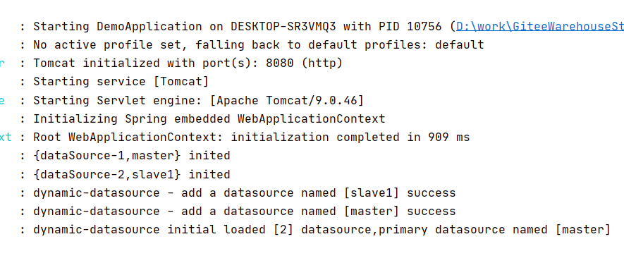

# SpringBoot整合Druid+DynamicDatasource


## 创建 SpringBoot 项目

项目架构如下


## 整合 Druid

### 添加依赖

```
<?xml version="1.0" encoding="UTF-8"?>
<project xmlns="http://maven.apache.org/POM/4.0.0" xmlns:xsi="http://www.w3.org/2001/XMLSchema-instance"
         xsi:schemaLocation="http://maven.apache.org/POM/4.0.0 https://maven.apache.org/xsd/maven-4.0.0.xsd">
    <modelVersion>4.0.0</modelVersion>
    <parent>
        <groupId>org.springframework.boot</groupId>
        <artifactId>spring-boot-starter-parent</artifactId>
        <version>2.6.13</version>
        <relativePath/>
    </parent>
    <groupId>com.example</groupId>
    <artifactId>DemoDynamicDatasource</artifactId>
    <version>0.0.1-SNAPSHOT</version>
    <name>动态数据源 Demo</name>
    <description>SpringBoot: 动态数据源 Demo</description>
    <properties>
        <java.version>1.8</java.version>
    </properties>
    <dependencies>

        <!-- Spring Boot 核心, 包含了 Tomcat, Jetty 和 Undertow -->
        <dependency>
            <groupId>org.springframework.boot</groupId>
            <artifactId>spring-boot-starter-web</artifactId>
        </dependency>

        <!-- 数据库驱动 -->
        <dependency>
            <groupId>mysql</groupId>
            <artifactId>mysql-connector-java</artifactId>
            <version>8.0.28</version>
        </dependency>

        <!-- Lombok, 需要在IDE中安装Lombok插件 -->
        <dependency>
            <groupId>org.projectlombok</groupId>
            <artifactId>lombok</artifactId>
            <optional>true</optional>
        </dependency>

        <!-- Junit 单元测试 -->
        <dependency>
            <groupId>org.springframework.boot</groupId>
            <artifactId>spring-boot-starter-test</artifactId>
            <scope>test</scope>
        </dependency>

        <!-- MyBatis-Plus -->
        <dependency>
            <groupId>com.baomidou</groupId>
            <artifactId>mybatis-plus-boot-starter</artifactId>
            <version>3.5.3.1</version>
        </dependency>

        <!-- Druid 数据库连接池 -->
        <dependency>
            <groupId>com.alibaba</groupId>
            <artifactId>druid-spring-boot-starter</artifactId>
            <version>1.1.23</version>
        </dependency>

    </dependencies>

    <build>
        <plugins>
            <plugin>
                <groupId>org.springframework.boot</groupId>
                <artifactId>spring-boot-maven-plugin</artifactId>
                <configuration>
                    <excludes>
                        <exclude>
                            <groupId>org.projectlombok</groupId>
                            <artifactId>lombok</artifactId>
                        </exclude>
                    </excludes>
                </configuration>
            </plugin>
        </plugins>
    </build>

</project>
```

### 修改配置文件 application.xml

```
spring:
  datasource:
    type: com.alibaba.druid.pool.DruidDataSource
    druid: # Druid 连接池
      initial-size: 5 # 初始化连接池大小
      min-idle: 5 # 最小连接池数量
      max-active: 20 # 最大连接池数量
      max-wait: 60000 # 连接时最大等待时间（单位：毫秒）
      test-while-idle: true
      time-between-eviction-runs-millis: 60000 # 配置多久进行一次检测，检测需要关闭的连接（单位：毫秒）
      min-evictable-idle-time-millis: 300000 # 配置一个连接在连接池中最小生存的时间（单位：毫秒）
      max-evictable-idle-time-millis: 900000 # 配置一个连接在连接池中最大生存的时间（单位：毫秒）
      validation-query: SELECT 1 FROM DUAL # 配置测试连接是否可用的查询 sql
      test-on-borrow: false
      test-on-return: false
      pool-prepared-statements: false
      web-stat-filter:
        enabled: true
      stat-view-servlet:
        enabled: true
        url-pattern: /druid/* # 配置监控后台访问路径
        login-username: admin # 配置监控后台登录的用户名、密码
        login-password: 123456
      filter:
        stat:
          enabled: true
          log-slow-sql: true # 开启慢 sql 记录
          slow-sql-millis: 2000 # 若执行耗时大于 2s，则视为慢 sql
          merge-sql: true
        wall: # 防火墙
          config:
            multi-statement-allow: true
```

### 访问测试

http://localhost:8080/druid/login.html

使用配置文件里面的用户名和密码登录即可


## 整合 DynamicDatasource

### 添加依赖

```
<!-- 动态数据源切换 -->
<dependency>
    <groupId>com.baomidou</groupId>
    <artifactId>dynamic-datasource-spring-boot-starter</artifactId>
    <version>3.6.1</version>
</dependency>
```

最终pom如下：

```
<?xml version="1.0" encoding="UTF-8"?>
<project xmlns="http://maven.apache.org/POM/4.0.0" xmlns:xsi="http://www.w3.org/2001/XMLSchema-instance"
         xsi:schemaLocation="http://maven.apache.org/POM/4.0.0 https://maven.apache.org/xsd/maven-4.0.0.xsd">
    <modelVersion>4.0.0</modelVersion>
    <parent>
        <groupId>org.springframework.boot</groupId>
        <artifactId>spring-boot-starter-parent</artifactId>
        <version>2.6.13</version>
        <relativePath/>
    </parent>
    <groupId>com.example</groupId>
    <artifactId>DemoDynamicDatasource</artifactId>
    <version>0.0.1-SNAPSHOT</version>
    <name>动态数据源 Demo</name>
    <description>SpringBoot: 动态数据源 Demo</description>
    <properties>
        <java.version>1.8</java.version>
    </properties>
    <dependencies>

        <!-- Spring Boot 核心, 包含了 Tomcat, Jetty 和 Undertow -->
        <dependency>
            <groupId>org.springframework.boot</groupId>
            <artifactId>spring-boot-starter-web</artifactId>
        </dependency>

        <!-- 数据库驱动 -->
        <dependency>
            <groupId>mysql</groupId>
            <artifactId>mysql-connector-java</artifactId>
            <version>8.0.28</version>
        </dependency>

        <!-- Lombok, 需要在IDE中安装Lombok插件 -->
        <dependency>
            <groupId>org.projectlombok</groupId>
            <artifactId>lombok</artifactId>
            <optional>true</optional>
        </dependency>

        <!-- Junit 单元测试 -->
        <dependency>
            <groupId>org.springframework.boot</groupId>
            <artifactId>spring-boot-starter-test</artifactId>
            <scope>test</scope>
        </dependency>

        <!-- MyBatis-Plus -->
        <dependency>
            <groupId>com.baomidou</groupId>
            <artifactId>mybatis-plus-boot-starter</artifactId>
            <version>3.5.3.1</version>
        </dependency>

        <!-- Druid 数据库连接池 -->
        <dependency>
            <groupId>com.alibaba</groupId>
            <artifactId>druid-spring-boot-starter</artifactId>
            <version>1.2.8</version>
        </dependency>

        <!-- 动态数据源切换 -->
        <dependency>
            <groupId>com.baomidou</groupId>
            <artifactId>dynamic-datasource-spring-boot-starter</artifactId>
            <version>3.6.1</version>
        </dependency>
        
    </dependencies>

    <build>
        <plugins>
            <plugin>
                <groupId>org.springframework.boot</groupId>
                <artifactId>spring-boot-maven-plugin</artifactId>
                <configuration>
                    <excludes>
                        <exclude>
                            <groupId>org.projectlombok</groupId>
                            <artifactId>lombok</artifactId>
                        </exclude>
                    </excludes>
                </configuration>
            </plugin>
        </plugins>
    </build>

</project>
```

### 修改配置文件，配置 dynamic

配置文件如下：

```
spring:
  datasource:
    type: com.alibaba.druid.pool.DruidDataSource
    druid: # Druid 连接池
      initial-size: 5 # 初始化连接池大小
      min-idle: 5 # 最小连接池数量
      max-active: 20 # 最大连接池数量
      max-wait: 60000 # 连接时最大等待时间（单位：毫秒）
      test-while-idle: true
      time-between-eviction-runs-millis: 60000 # 配置多久进行一次检测，检测需要关闭的连接（单位：毫秒）
      min-evictable-idle-time-millis: 300000 # 配置一个连接在连接池中最小生存的时间（单位：毫秒）
      max-evictable-idle-time-millis: 900000 # 配置一个连接在连接池中最大生存的时间（单位：毫秒）
      validation-query: SELECT 1 FROM DUAL # 配置测试连接是否可用的查询 sql
      test-on-borrow: false
      test-on-return: false
      pool-prepared-statements: false
      web-stat-filter:
        enabled: true
      stat-view-servlet:
        enabled: true
        url-pattern: /druid/* # 配置监控后台访问路径
        login-username: admin # 配置监控后台登录的用户名、密码
        login-password: 123456
      filter:
        stat:
          enabled: true
          log-slow-sql: true # 开启慢 sql 记录
          slow-sql-millis: 2000 # 若执行耗时大于 2s，则视为慢 sql
          merge-sql: true
        wall: # 防火墙
          config:
            multi-statement-allow: true
    dynamic:
      primary: master # 设置默认数据源
      datasource:
        # master 数据源配置
        master:
          driver-class-name: com.mysql.cj.jdbc.Driver
          url: jdbc:mysql://localhost:3306/demo-dynamic-datasource-master?autoReconnect=true&useUnicode=true&characterEncoding=utf8&serverTimezone=Asia/Shanghai
          username: root
          password: 123456
        # slave1 数据源配置
        slave1:
          driver-class-name: com.mysql.cj.jdbc.Driver
          url: jdbc:mysql://localhost:3306/demo-dynamic-datasource-slave1?autoReconnect=true&useUnicode=true&characterEncoding=utf8&serverTimezone=Asia/Shanghai
          username: root
          password: 123456
```

### 添加测试代码

#### controller

```
package com.example.demo.controller;

import com.example.demo.service.UserService;
import lombok.RequiredArgsConstructor;
import lombok.extern.slf4j.Slf4j;
import org.springframework.web.bind.annotation.GetMapping;
import org.springframework.web.bind.annotation.RestController;


/**
 * 用户控制器类
 *
 * @author 一陌千尘
 * @date 2025/01/02
 */
@Slf4j
@RestController
@RequiredArgsConstructor
public class UserController {

    private final UserService service;

    @GetMapping("test1")
    public String test1() {
        return service.test1();
    }

    @GetMapping("test2")
    public String test2() {
        return service.test2();
    }
}
```

#### service

```
package com.example.demo.service;

import com.baomidou.mybatisplus.extension.service.IService;
import com.example.demo.entity.User;

/**
 * 用户服务接口
 *
 * @author 一陌千尘
 * @date 2025/01/02
 */
public interface UserService  {

    // 测试方法1
    String test1();

    // 测试方法2
    String test2();
}
```

#### impl

```
package com.example.demo.service.impl;

import com.baomidou.dynamic.datasource.annotation.DS;
import com.baomidou.mybatisplus.core.conditions.query.LambdaQueryWrapper;
import com.baomidou.mybatisplus.core.toolkit.Wrappers;
import com.baomidou.mybatisplus.extension.service.impl.ServiceImpl;
import com.example.demo.entity.Order;
import com.example.demo.entity.User;
import com.example.demo.mapper.Order2Mapper;
import com.example.demo.mapper.OrderMapper;
import com.example.demo.mapper.UserMapper;
import com.example.demo.service.UserService;
import lombok.RequiredArgsConstructor;
import lombok.extern.slf4j.Slf4j;
import org.springframework.stereotype.Service;


/**
 * 用户服务实现类
 *
 * @author 一陌千尘
 * @date 2025/01/02
 */
@DS("master") // 指定数据源，不指定则使用默认数据源 master
@Slf4j
@Service
@RequiredArgsConstructor
public class UserServiceImpl extends ServiceImpl<UserMapper, User> implements UserService {

    // 使用 master 数据源
    private final UserMapper userMapper;
    // 使用 slave1 数据源
    private final OrderMapper orderMapper;
    // 未指定数据源
    private final Order2Mapper order2Mapper;

    @Override
    public String test1() {
        LambdaQueryWrapper<User> userLambdaQueryWrapper = Wrappers.lambdaQuery(User.class).eq(User::getName, "aaa");
        User user = userMapper.selectOne(userLambdaQueryWrapper);
        log.info("test1 ===== user: {}", user.getName());
        LambdaQueryWrapper<Order> orderLambdaQueryWrapper = Wrappers.lambdaQuery(Order.class).eq(Order::getCode, "bbb");
        Order order = orderMapper.selectOne(orderLambdaQueryWrapper);
        log.info("test1 ===== order: {}", order.getCode());
        return "ok";
    }

    @Override
    @DS("slave1") // 指定数据源，不指定则使用类上指定的数据源，如果类上未指定则使用默认数据源 master
    public String test2() {
        LambdaQueryWrapper<Order> userLambdaQueryWrapper = Wrappers.lambdaQuery(Order.class).eq(Order::getCode, "bbb");
        Order order = order2Mapper.selectOne(userLambdaQueryWrapper);
        log.info("test2 ===== order: {}", order.getCode());
        return "ok";
    }

}
```

#### mapper

```
package com.example.demo.mapper;

import com.baomidou.dynamic.datasource.annotation.DS;
import com.baomidou.mybatisplus.core.mapper.BaseMapper;
import com.example.demo.entity.User;

/**
 * 用户表 Mapper 接口
 *
 * @author 一陌千尘
 * @date 2025/01/02
 */
@DS("master")
public interface UserMapper extends BaseMapper<User> {

}
```

```
package com.example.demo.mapper;

import com.baomidou.dynamic.datasource.annotation.DS;
import com.baomidou.mybatisplus.core.mapper.BaseMapper;
import com.example.demo.entity.Order;

/**
 * 订单表 Mapper 接口
 *
 * @author 一陌千尘
 * @date 2025/01/02
 */
@DS("slave1")
public interface OrderMapper extends BaseMapper<Order> {

}
```

```
package com.example.demo.mapper;

import com.baomidou.mybatisplus.core.mapper.BaseMapper;
import com.example.demo.entity.Order;
import org.apache.ibatis.annotations.Select;

/**
 * 订单表 Mapper 接口2
 *
 * @author 一陌千尘
 * @date 2025/01/02
 */
public interface Order2Mapper extends BaseMapper<Order> {

}
```

#### entity

```
package com.example.demo.entity;

import com.baomidou.mybatisplus.annotation.IdType;
import com.baomidou.mybatisplus.annotation.TableId;
import com.baomidou.mybatisplus.annotation.TableName;
import lombok.Data;

/**
 * 用户实体类
 *
 * @author 一陌千尘
 * @date 2025/01/02
 */
@TableName("user")
@Data
public class User {

    @TableId(type = IdType.AUTO)
    private Long id;
    private String name;
    private String phone;
}
```

```
package com.example.demo.entity;

import com.baomidou.mybatisplus.annotation.IdType;
import com.baomidou.mybatisplus.annotation.TableId;
import com.baomidou.mybatisplus.annotation.TableName;
import lombok.Data;

/**
 * 订单实体类
 *
 * @author 一陌千尘
 * @date 2025/01/02
 */
@TableName("order")
@Data
public class Order {

    @TableId(type = IdType.AUTO)
    private Long id;
    private String code;
    private double amount;
}
```

#### SQL

```
SET NAMES utf8mb4;
SET FOREIGN_KEY_CHECKS = 0;

-- ----------------------------
-- Table structure for user
-- ----------------------------
DROP TABLE IF EXISTS `user`;
CREATE TABLE `user`  (
  `id` int(0) UNSIGNED NOT NULL AUTO_INCREMENT,
  `name` varchar(255) CHARACTER SET utf8mb4 COLLATE utf8mb4_general_ci NULL DEFAULT NULL,
  PRIMARY KEY (`id`) USING BTREE
) ENGINE = InnoDB AUTO_INCREMENT = 3 CHARACTER SET = utf8mb4 COLLATE = utf8mb4_general_ci ROW_FORMAT = Dynamic;

-- ----------------------------
-- Records of user
-- ----------------------------
INSERT INTO `user` VALUES (1, 'aaa');
INSERT INTO `user` VALUES (2, 'ccc');

SET FOREIGN_KEY_CHECKS = 1;
```

```
SET NAMES utf8mb4;
SET FOREIGN_KEY_CHECKS = 0;

-- ----------------------------
-- Table structure for order
-- ----------------------------
DROP TABLE IF EXISTS `order`;
CREATE TABLE `order`  (
  `id` int(0) UNSIGNED NOT NULL AUTO_INCREMENT,
  `code` varchar(255) CHARACTER SET utf8mb4 COLLATE utf8mb4_general_ci NULL DEFAULT NULL,
  PRIMARY KEY (`id`) USING BTREE
) ENGINE = InnoDB AUTO_INCREMENT = 4 CHARACTER SET = utf8mb4 COLLATE = utf8mb4_general_ci ROW_FORMAT = Dynamic;

-- ----------------------------
-- Records of order
-- ----------------------------
INSERT INTO `order` VALUES (1, 'aaa');
INSERT INTO `order` VALUES (2, 'bbb');
INSERT INTO `order` VALUES (3, 'ccc');

SET FOREIGN_KEY_CHECKS = 1;
```

### 启动测试

启动的时候，注意查看日志，如下：



运行后可以测试得出使用动态数据源了
